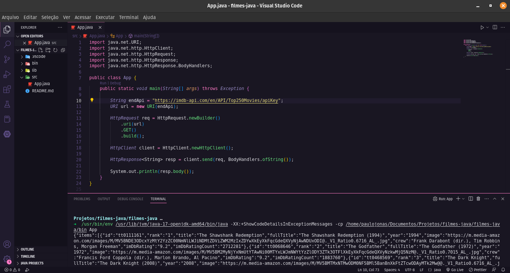
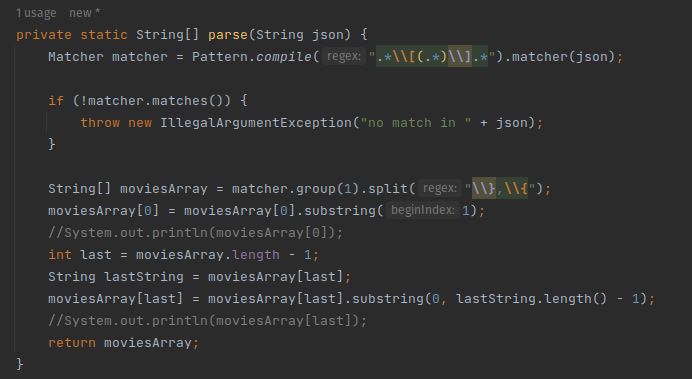
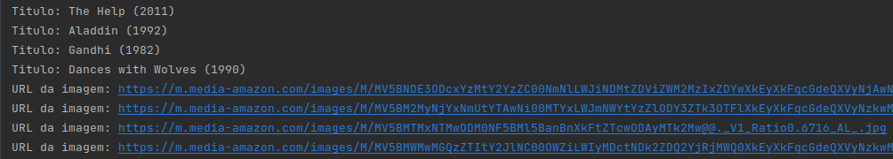

## 7DaysOfCode - Java

Projeto desenvolvido para cumprir os desafios do 7DaysOfCode da Alura. Um projeto que tem a finalidade de consumir a API do IMDB, um site que armazena dados sobre filmes, series e atores, com uma base de dados enorme.

## Tecnologias utilizadas (projeto ainda em desenvolvimento)

Aqui estao alguimas tecnologias utilizadas no desenvolvimento do projeto:

- Java

### 1º dia do desafio

No primeiro dia do desafio, foi pedido que utilizando a linguagem Java, acessassemos a API do IMDB, para poder mostar na linha de comando os Top 250 Filmes.

#### Passos realizados
- Para realizar o acesso, foi necessario efetuar cadastro na plataforma da [API-IMDB](https://imdb-api.com/api).
- Criado o projeto pelo VS Code: utilizando a paleta de comandos (Ctrl + Shift + P), sem ferramentas de build inicialmente;
- Com o projeto criado, substitui o tradicional **"Hello World" do Java**, pelo codigo responsavel para mostrar a lista de filmes;
- Dentro do metodo `main`, foram utilizadas as classes HttpRequest, HttpClient e HttpResponse, todas do pacote `java.net.http`, além da URI, do pacote `java.net.URI`;
- Foi preciso gerar um `client`, para poder realizar a requisicao, de forma que pudesse pegar o JSON da resposta e mostrar na linha de comando;

### 2º dia do desafio

No segundo dia do desafio, foi pedido que após receber o `json` com a resposta da chamada da API, devíamos parsear a resposta de forma a obter o título, a url da imagem, ano e imdb rating de cada filme.

#### Passos realizados
- Foi criado o método `private static String[] parse(String json){}`, com a finalidade de parsear o json recebido da API, retornando um Array de todos os filmes;
- Utilizando `regex` com o padrão `".*\\[(.*)\\].*"`, com as classes `Matcher` e `Pattern`, pude percorrer a resposta recebida, com a finalidade de eliminar os `[]`, para isolar a string do json;
- Para eliminar as `{}`, primeiro foi definido o padrão `"\\},\\{"`, percorrendo cada item do Array, utilizando os métodos `group`, `split` e `substring`;
- Criado o método `private static List<String> parseAtrib(String[] moviesArray, int pos){}` para parsear cada atributo presente no array, onde recebe o array de filmes e a posição específica do atributo desejado;
- A partir do método `parseAtrib` é possível pegar qualquer atributo do array, apenas criando um método específico para cada um que desejar;

