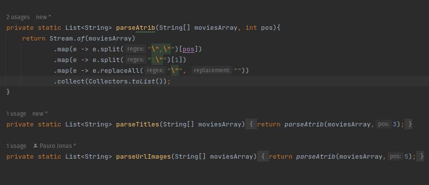

## 7DaysOfCode - Java

Projeto desenvolvido para cumprir os desafios do 7DaysOfCode da Alura. Um projeto que tem a finalidade de consumir a API do IMDB, um site que armazena dados sobre filmes, series e atores, com uma base de dados enorme.

## Tecnologias utilizadas (projeto ainda em desenvolvimento)

Aqui estão alguimas tecnologias utilizadas no desenvolvimento do projeto:

- Java
- HTML
- [Bootstrap](https://getbootstrap.com/)

### 1º dia do desafio

No primeiro dia do desafio, foi pedido que utilizando a linguagem Java, acessássemos a API do IMDB, para mostar, na linha de comando, os Top 250 Filmes.

#### Passos realizados
- Para realizar o acesso, foi necessário efetuar cadastro na plataforma da [API-IMDB](https://imdb-api.com/api).
- Criado o projeto pelo VS Code: utilizando a paleta de comandos (Ctrl + Shift + P), sem ferramentas de build inicialmente;
- Com o projeto criado, substitui o tradicional **"Hello World" do Java**, pelo código responsavel para mostrar a lista de filmes;
- Dentro do método `main`, foram utilizadas as classes HttpRequest, HttpClient e HttpResponse, todas do pacote `java.net.http`, além da URI, do pacote `java.net.URI`;
- Foi preciso gerar um `client`, para poder realizar a requisição, de forma que pudesse pegar o JSON da resposta e mostrar na linha de comando;

### 2º dia do desafio

No segundo dia do desafio, foi pedido que após receber o `json` com a resposta da chamada da API, devíamos parsear a resposta de forma a obter o título, a url da imagem, ano e a nota de cada filme.

#### Passos realizados
- Foi criado o método `private static String[] parse(String json){}`, com a finalidade de parsear o json recebido da API, retornando um Array de todos os filmes;
- Utilizando `regex` com o padrão `".*\\[(.*)\\].*"`, com as classes `Matcher` e `Pattern`, pude percorrer a resposta recebida, com a finalidade de eliminar os `[]`, para isolar a string do json;
- Para eliminar as `{}`, primeiro foi definido o padrão `"\\},\\{"`, percorrendo cada item do Array, utilizando os métodos `group`, `split` e `substring`;
- Criado o método `private static List<String> parseAtrib(String[] moviesArray, int pos){}` para parsear cada atributo presente no array, onde recebe o array de filmes e a posição específica do atributo desejado;
- A partir do método `parseAtrib` é possível pegar qualquer atributo do array, apenas criando um método específico para cada um que desejar;

### 3º dia do desafio

No terceiro dia do desafio, foi pedido para fazer uma melhor modelagem do código, já com pensamento em Orientação a Objeto. E levantamento de algumas reflexões.

#### Passos realizados
- Foram criadas as classes `Movie` e `ListMovies`.
- A primeira classe recebe os dados dos filmes (título, urlImagem, ano e nota);
- A segunda classe cria a lista de filmes, nela foi colocado o método para parsear o json recebido da chamada da API, adicionando um método que pega cada valor de forma isolada, de forma a gerar um novo objeto `Movie`, cada vez que a função passa pelo `json`.
- Não havia a necessidade de implementar `setters` para a classe `Movie`, pois esses dados são enviados pela API, não fazendo necessário sua manipulação para edição dessas informações.

### 4º dia do desafio

No quarto dia do desafio, foi pedido para gerar o `HTML` da página para exibir a lista dos TOP 250 filmes da API do IMDB, ao usuário.

#### Passos realizados
- Dentro da classe principal, foi criado uma variável do tipo `FileWriter` para gerar um arquivo HTML, dentro da pasta raiz do projeto.
- Em seguida, utilizando o método `write`, foram criadas as linhas do arquivo HTML passando toda a estrutura da página.
- Para estilizar a página, foi adicionado via CDN, o Bootstrap, biblioteca CSS bastante utilizada na estilização de sites e WebApps.
- Dentro dessa estrutura, foi montando uma estrutura de repetição com `for`, de forma a percorrer cada item da lista de filmes, para gerar um card com as informações de cada um.

